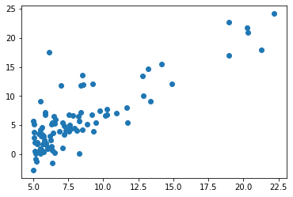
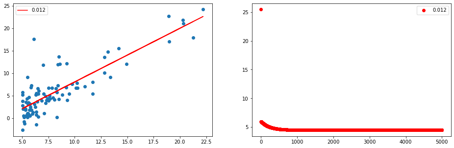
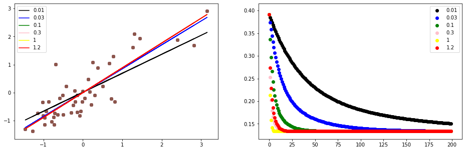

```python
import numpy as np
import pandas as pd
from matplotlib import pyplot as plt
```


```python
A = np.eye(5)
A
```


    array([[1., 0., 0., 0., 0.],
           [0., 1., 0., 0., 0.],
           [0., 0., 1., 0., 0.],
           [0., 0., 0., 1., 0.],
           [0., 0., 0., 0., 1.]])


```python
data = np.loadtxt('ex1data1.txt',delimiter=',')
X = data[:,0]
y = data[:,1]
plt.scatter(X,y)
plt.show()
```





```python
m = len(data)
constant = np.ones(m).reshape(m,1)  #为数据添加x0=[1……1]列，用来补充theta0.
new_data = np.hstack((constant,data))
X = new_data[:,:-1]
y = new_data[:,-1]
```


```python
#定义loss function函数，theta[i]为每个特征x[i]的系数，X为m*n的矩阵，其中m为样本数，n为特征数（包括x0=ones(m)）
def LossFunction(theta,X,y):       
    Loss = np.sum(pow(theta.dot(X.T) - y,2) / (2*len(y)))
    return Loss

#梯度下降
def GradientDescent(theta,alpha=0.005):
    GD_step = (theta.dot(X.T) - y).dot(X) / len(y)
    theta -= alpha * GD_step
    return theta

```


```python
###根据数据集进行梯度下降
fig = plt.figure(figsize = (16,5))
ax1 = fig.add_subplot(121)
ax2 = fig.add_subplot(122)
Alpha = [0.012]#[0.003,0.006,0.009,0.015,0.02]
color = ['red']#['black','blue','green','pink','red','yellow']
for alpha in Alpha:
    Loss = np.array([])
    theta = np.array([0.1,0.1])
    for i in range(5000):
        loss = LossFunction(theta,X,y)
        theta = GradientDescent(theta,alpha=alpha)
        Loss = np.append(Loss,loss)
    print(Loss[:10],alpha)
    ax2.scatter(np.arange(5000),Loss,color=color[Alpha.index(alpha)],label=alpha)
    ax1.scatter(X[:,-1],y)
    ax1.plot(X[:,-1],theta.dot(X.T),color=color[Alpha.index(alpha)],label=alpha)
ax1.legend(loc='upper left')
ax2.legend(loc='upper right')
# best learning rate ---- alpha is 0.012
```

    [25.44955311  5.97795876  5.96803572  5.9615914   5.95517554  5.9487874
      5.94242687  5.93609383  5.92978816  5.92350974] 0.012
    


    <matplotlib.legend.Legend at 0xe025a10>





```python
data = np.loadtxt('ex1data2.txt',delimiter=',')
m = len(data)
constant = np.ones(m).reshape(m,1)  #为数据添加x0=[1……1]列，用来补充theta0.
new_data = np.hstack((constant,data))
X = new_data[:,:-1]
y = new_data[:,-1]
#feature normalization
X[:,1] = (X[:,1]-np.mean(X[:,1]))/np.std(X[:,1])
X[:,2] = (X[:,2]-np.mean(X[:,2]))/np.std(X[:,2])
y = (y-np.mean(y))/np.std(y)


##梯度下降
fig = plt.figure(figsize = (16,5))
ax1 = fig.add_subplot(121)
ax2 = fig.add_subplot(122)
Alpha = [0.01,0.03,0.1,0.3,1,1.2]
color = ['black','blue','green','pink','yellow','red']
for alpha in Alpha:
    Loss = np.array([])
    theta = np.array([0.1,0.1,0.1])
    for i in range(200):
        loss = LossFunction(theta,X,y)
        theta = GradientDescent(theta,alpha=alpha)
        Loss = np.append(Loss,loss)
    print(loss,alpha)
    ax2.scatter(np.arange(200),Loss,color=color[Alpha.index(alpha)],label=alpha)
    ax1.scatter(X[:,1],y)
    ax1.plot(X[:,1],theta[:2].dot(X[:,:2].T),color=color[Alpha.index(alpha)],label=alpha)
ax1.legend(loc='upper left')
ax2.legend(loc='upper right')
#best learning rate alpha is 1
```

    0.15064757650214258 0.01
    0.13401595233895466 0.03
    0.13352749259777577 0.1
    0.1335274909855429 0.3
    0.13352749098554287 1
    0.13352749098554284 1.2
    


    <matplotlib.legend.Legend at 0x193c610>





```python

```
