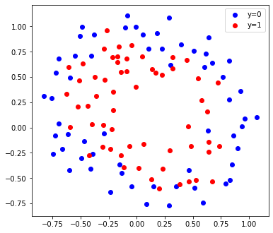
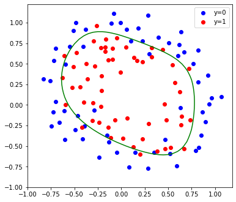

```python
import numpy as np
import pandas as pd
from matplotlib import pyplot as plt
```


```python
#数据列重命名
data = pd.read_csv('ex2data1.txt',sep=',',header=None)
data.columns=['exam1_s','exam2_s','results']
```


```python
#数据可视化,0表示不通过，1表示通过
class0 = data[data['results']==0]
class1 = data[data['results']==1]
plt.scatter(class0['exam1_s'],class0['exam2_s'],marker='o',color='b',label='y=0')
plt.scatter(class1['exam1_s'],class1['exam2_s'],marker='s',color='r',label='y=1')
plt.legend(loc='best')
plt.xlabel('exam1_socre')
plt.ylabel('exam2_socre')
plt.show()
```


```python
#sigmoid函数
def sigmoid(x):
    return 1/(1+np.exp(-x))
# X=np.arange(-10,10,0.2)
# plt.plot(X,sigmoid(X))

#损失函数用交叉熵 loss=-(y*log(f(x)+(1-y)*log(1-f(x)))
def loss_function(theta,X,y):
    loss = -(np.log(sigmoid(theta.dot(X.T)))*y+np.log(1-sigmoid(theta.dot(X.T)))*(1-y))
    return np.sum(loss)/len(y)

#用梯度下降更新theta值
def gradient_descent(theta,X,y,alpha=0.01):
    theta -= alpha/len(y)*((sigmoid(theta.dot(X.T))-y).dot(X))
    return theta
```


```python
##利用梯度下降对刚才的数据经行逻辑回归分类(使用线性关系对数据进行分类)

data_mat = data.values
m = len(data_mat)

#首先增加常数项，x0=1,连接数组
constants = np.ones(m).reshape(m,1)
data_mat = np.hstack((constants,data_mat))

#数据分成特征X与结果y
X = data_mat[:,:-1]
y = data_mat[:,-1]

#特征缩放
mean1,std1 = np.mean(X[:,1]),np.std(X[:,1])
mean2,std2 = np.mean(X[:,2]),np.std(X[:,2])
X[:,1] = (X[:,1] - mean1) / std1
X[:,2] = (X[:,2] - mean2) / std2

#初始化theta值
theta = np.array([1.0,1.0,1.0])

#迭代计算
for i in range(500):
    Loss = loss_function(theta,X,y)
    theta = gradient_descent(theta,X,y,alpha=2)
    
    #plot loss下降趋势
    plt.scatter(i,Loss)
print(Loss,theta)
```

    0.20349777750574552 [1.71683555 3.98934142 3.72180175]
    


```python
##利用梯度下降对刚才的数据经行逻辑回归分类(增加特征维度，square(x1),square(x2),以及crossmultiply(x1,x2))

data_mat = data.values
m = len(data_mat)

#特征缩放
mean_std = []
for i in range(0,data_mat.shape[1]-1):
    mean,std = np.mean(data_mat[:,i]),np.std(data_mat[:,i])
    data_mat[:,i] = (data_mat[:,i] - mean) / std
    mean_std.append((mean,std))

#首先增加常数项，x0=1,
constants = np.ones(m).reshape(m,1)
#增加squre(x1),squre(x2),以及crossmultiply(x1,x2)
square_x1 = np.square(data_mat[:,0]).reshape(m,1)
square_x2 = np.square(data_mat[:,1]).reshape(m,1)
mlp_x1x2 = (data_mat[:,0]*data_mat[:,1]).reshape(m,1)
#拼接组成多维度数据
data_mat = np.hstack((constants,square_x1,square_x2,mlp_x1x2,data_mat))

#数据分成特征X与结果y
X = data_mat[:,:-1]
y = data_mat[:,-1]

#初始化theta值
theta = np.ones(data_mat.shape[1]-1)

#迭代计算
for i in range(600):
    Loss = loss_function(theta,X,y)
    theta = gradient_descent(theta,X,y,alpha=10)
    
    #plot loss下降趋势
    plt.scatter(i,Loss,c='b')
print(Loss,theta)
```

    0.025413017430915504 [14.5166337  -6.31774865 -3.96095354 -2.36725105 14.36507008 14.56330441]
    


```python

```


```python
class0 = data[data['results']==0]
class1 = data[data['results']==1]
plt.scatter((class0['exam1_s'].values-mean1)/std1,(class0['exam2_s'].values-mean2)/std2,marker='o',color='b',label='y=0')
plt.scatter((class1['exam1_s'].values-mean1)/std1,(class1['exam2_s'].values-mean2)/std2,marker='s',color='r',label='y=1')
plt.legend(loc='best')
plt.xlabel('exam1_score')
plt.ylabel('exam2_score')

#线性分类
# plt.plot(X[:,1],(0.5-(theta[0]+theta[1]*X[:,1]))/theta[2],c='g')

#多项式分类
x1 = np.arange(-1.4,1.8,0.1)
x2 = (-(theta[3]*x1+theta[5])+np.sqrt(np.square(theta[3]*x1+theta[5])-4*theta[2]*(theta[0]+theta[1]*np.square(x1)+theta[4]*x1)))/(2*theta[2])
plt.plot(x1,x2,c='g')

plt.show()
theta
```


    array([14.5166337 , -6.31774865, -3.96095354, -2.36725105, 14.36507008,
           14.56330441])


```python

```


```python

```


```python

```


```python

```


```python

```


```python

```


```python
data2 = pd.read_csv('ex2data2.txt',sep=',',header=None)
data2.columns = ['x1','x2','y']

class0 = data2[data2['y']==0]
class1 = data2[data2['y']==1]
fig = plt.figure(figsize=(6,5.5))
ax1 = fig.add_subplot(111)
ax1.scatter(class0['x1'],class0['x2'],c='b',label='y=0')
ax1.scatter(class1['x1'],class1['x2'],c='r',label='y=1')
ax1.legend(loc='best')
plt.show()
```





```python
#特征维度扩展，使用六阶多项式拟合，得到28个特征向量，并保存文件
x1 = data2['x1'].values
x2 = data2['x2'].values
y = data2['y'].values
X = np.array([])
for i in range(1,7):
    for j in range(i+1):
        temp = np.power(x1,i-j)*np.power(x2,j)
        X = np.append(X,temp)
X = np.append(X,y)
X = np.append(np.ones(x1.shape[0]),X)
X.shape
X = X.reshape(-1,x1.shape[0]).T
np.savetxt('ex2data2_feature_expand.txt',X,delimiter=',')
```


```python
#载入数据,分割特征与结果
new_data2 = np.loadtxt('ex2data2_feature_expand.txt',delimiter=',')
X = new_data2[:,:-1]
y = new_data2[:,-1]
```


```python
#损失函数加入二范数正则项，重写损失函数与梯度下降，正则项不做用于常数项theta[0]

#损失函数用交叉熵 loss=-(y*log(f(x)+(1-y)*log(1-f(x))) + lamda*square(theta)/2m
def loss_function_reg(theta,X,y,lamda=0):
    loss = np.sum(-(np.log(sigmoid(theta.dot(X.T)))*y+np.log(1-sigmoid(theta.dot(X.T)))*(1-y)))/len(y)+np.sum(lamda*np.square(theta[1:]))/(2*len(y))
    return loss

#用梯度下降更新theta值
def gradient_descent_reg(theta,X,y,alpha=0.01,lamda=0):
    theta[0] -= alpha/len(y)*((sigmoid(theta.dot(X.T))-y).dot(X[:,0]))
    theta[1:] -= alpha/len(y)*(((sigmoid(theta.dot(X.T))-y).dot(X[:,1:])) + lamda/len(y)*theta[1:])
    return theta
```


```python
#初始化theta值
theta = np.ones(X.shape[1])

#迭代计算
for i in range(1000):
    Loss = loss_function_reg(theta,X,y,lamda=0)
    theta = gradient_descent_reg(theta,X,y,alpha=5,lamda=0)
    
    #plot loss下降趋势
    plt.scatter(i,Loss,c='b')
print(Loss,theta)
```

    0.32065139557970135 [ 4.11145354  2.47225081  4.82784339 -5.82878918 -6.88381781 -7.70003575
      1.68975775 -1.38436122  1.27663577 -1.96327355 -4.80231398  2.82962897
     -3.12112301 -2.52152299 -4.68598536 -1.30110678 -0.14819527  3.77568656
     -2.58416766 -2.63993774  1.75314593 -4.82579429  1.86114608 -0.46615725
      2.45005423 -2.38846983 -2.54413531  0.28888016]
    


```python
#plot data
class0 = data2[data2['y']==0]
class1 = data2[data2['y']==1]
fig = plt.figure(figsize=(6,5.5))
ax1 = fig.add_subplot(111)
ax1.scatter(class0['x1'],class0['x2'],c='b',label='y=0')
ax1.scatter(class1['x1'],class1['x2'],c='r',label='y=1')
ax1.legend(loc='best')

#plot decision boundary
x1=x2=np.arange(-1,1.05,0.05)
x1,x2=np.meshgrid(x1,x2)
Z = np.concatenate([theta[0]*np.ones((len(x1),len(x1)))+theta[1]*x1+theta[2]*x2+theta[3]*x1**2+theta[4]*x1*x2+theta[5]*x2**2+theta[6]*x1**3+theta[7]*x1**2*x2+theta[8]*x1*x2**2+theta[9]*x2**3+theta[10]*x1**4+theta[11]*x1**3*x2+theta[12]*x1**2*x2**2+theta[13]*x1*x2**3+
              theta[14]*x2**4+theta[15]*x1**5+theta[16]*x1**4*x2+theta[17]*x1**3*x2**2+theta[18]*x1**2*x2**3+theta[19]*x1*x2**4+theta[20]*x2**5+theta[21]*x1**6+theta[22]*x1**5*x2+theta[23]*x1**4*x2**2+theta[24]*x1**3*x2**3+theta[25]*x1**2*x2**4+theta[26]*x1*x2**5+theta[27]*x2**6],axis=1)
ax1.contour(x1,x2,Z,[0],colors='g')
plt.show()
theta
```





    array([ 4.11145354,  2.47225081,  4.82784339, -5.82878918, -6.88381781,
           -7.70003575,  1.68975775, -1.38436122,  1.27663577, -1.96327355,
           -4.80231398,  2.82962897, -3.12112301, -2.52152299, -4.68598536,
           -1.30110678, -0.14819527,  3.77568656, -2.58416766, -2.63993774,
            1.75314593, -4.82579429,  1.86114608, -0.46615725,  2.45005423,
           -2.38846983, -2.54413531,  0.28888016])


```python

```


```python

```


```python

```
