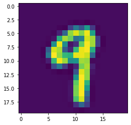
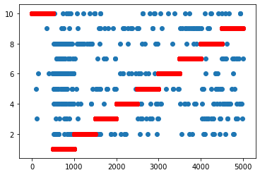

```python
import scipy.io as sio
import numpy as np
import pandas as pd
import matplotlib.pyplot as plt
%matplotlib inline
```


```python
#图像可视化
import time
data3 = sio.loadmat('ex3data1.mat')
for i in range(4980,4981):
    a = data3['X'][i,:].reshape(20,20)
    plt.imshow(a.T)
    plt.show()
    time.sleep(1)
```





```python
#类别划分，对每个类别的y值改成非0即1
new_data3 = np.hstack((data3['X'],data3['y']))
data3_df = pd.DataFrame(new_data3)
all_class = {}
for i in range(10):
    temp = data3_df.copy()
    if i == 0:
        temp[400][temp[400]==10]=1
        temp[400][temp[400]!=1]=0
    else:
        temp[400][temp[400]==i]=1
        temp[400][temp[400]!=1]=0
    all_class[i] = temp
```


```python
#sigmoid函数
def sigmoid(x):
    return 1/(1+np.exp(-x))

#损失函数加入二范数正则项，重写损失函数与梯度下降，正则项不做用于常数项theta[0]

#损失函数用交叉熵 loss=-(y*log(f(x)+(1-y)*log(1-f(x))) + lamda*square(theta)/2m
def loss_function_reg(theta,X,y,lamda=0):
#     print(sigmoid(theta.dot(X.T)))
#     print(theta.dot(X.T))
    loss = np.sum(-(np.log(sigmoid(theta.dot(X.T)))*y+np.log(1-sigmoid(theta.dot(X.T)))*(1-y)))/len(y)
    +np.sum(lamda*np.square(theta[1:]))/(2*len(y))
#     print(loss)
    return loss

#用梯度下降更新theta值
def gradient_descent_reg(theta,X,y,alpha=0.01,lamda=0):
    theta[0] -= alpha/len(y)*((sigmoid(theta.dot(X.T))-y).dot(X[:,0]))
    theta[1:] -= alpha/len(y)*(((sigmoid(theta.dot(X.T))-y).dot(X[:,1:])) + lamda/len(y)*theta[1:])
#     print(theta)
    return theta
```


```python
constants = np.ones(5000).reshape(5000,1)
Theta = np.array([])
Loss = []
#分特征与结果，训练LR模型
for i in range(10):
    X = all_class[i].values[:,:-1]
    X = np.hstack((constants,X))
    y = all_class[i].values[:,-1]
    theta = np.zeros(401)
    color = ['black','blue','green','yellow','pink','red','purple','cyan','magenta','brown']
    for j in range(20000):
        loss = loss_function_reg(theta,X,y,lamda=1)
        theta = gradient_descent_reg(theta,X,y,alpha=1.8+0.14*i,lamda=1)
#         plt.scatter(j,loss,c=color[i])
#     plt.scatter(0,0,c=color[i],label='y=%d' %i)
    Theta = np.append(Theta,theta)
    Loss.append(loss)
Theta = Theta.reshape(10,-1)
# print(theta.dot(X.T).shape)
# plt.scatter(np.arange(0,401),X.T[:,0])
# plt.scatter(np.arange(0,401),theta,c='r')
print(sum(Loss))
print(Theta)
# plt.legend(loc='best')
```

    0.7495792191439358
    [[-3.65345672e-01  0.00000000e+00  0.00000000e+00 ... -3.37835560e-03
       1.05707321e-03  0.00000000e+00]
     [-3.26895659e+00  0.00000000e+00  0.00000000e+00 ...  7.09746552e-03
       2.53933467e-07  0.00000000e+00]
     [-5.81771739e-01  0.00000000e+00  0.00000000e+00 ...  4.74679223e-02
      -4.30174960e-03  0.00000000e+00]
     ...
     [ 1.26562271e+00  0.00000000e+00  0.00000000e+00 ...  3.05638166e-03
       1.40503054e-03  0.00000000e+00]
     [-5.87766969e+00  0.00000000e+00  0.00000000e+00 ...  1.09530331e-02
       1.51557259e-04  0.00000000e+00]
     [-2.00992393e+00  0.00000000e+00  0.00000000e+00 ... -2.36736425e-02
       2.88135471e-03  0.00000000e+00]]
    


```python
#对单个样本预测
def predict_result(sample,theta):
    prob = sigmoid(theta.dot(sample))
    return prob
```


```python
##利用得到的theta参数计算预测正确率
#计算每一个样本与真实结果比对
new_data4 = np.hstack((constants,new_data3))
Samples = new_data4[:,:-1]
results = new_data4[:,-1]
counts = 0
predict_class = []
for j in range(5000):
    sample = Samples[j,:]
    p = []
    for i in range(10):
        theta = Theta[i,:]
        p.append(predict_result(sample,theta))
#     print(p)
    Max_pro_index = p.index(max(p))
#     print(Max_pro_index)
    if Max_pro_index == 0:
        Max_pro_index = 10
#         print(Max_pro_index,results[j],Max_pro_index == results[j])
    if Max_pro_index == results[j]:
        counts += 1
    predict_class.append(Max_pro_index)
predict_precision = counts/5000
plt.scatter(range(5000),predict_class)
plt.scatter(range(5000),results,c='r')
plt.show()
predict_precision
```





    0.916


```python
new_data4 = np.hstack((constants,new_data3))
Samples = new_data4[:,:-1]
results = new_data4[:,-1]
Counts = []
predict_class = P = []
for i in range(10):
    counts = 0
    for j in range(5000):
        sample = Samples[j,:]
        theta = Theta[i,:]
        p = predict_result(sample,theta)
        if p > 0.5:
            counts += 1
    Counts.append(counts)
#         plt.scatter(j,p,c='g')
Counts
```


    [968, 495, 975, 982, 971, 889, 1002, 980, 877, 726]


```python

```


    (5000, 401)


```python
compare_data = np.hstack((np.array(predict_class),results)).reshape(2,5000).T
df = pd.DataFrame(compare_data)
P = []
for i in range(1,11):
    pb = df[0][df[1]==i].value_counts()[i]
    P.append(pb)
sum(P)/5000
```


    ---------------------------------------------------------------------------

    NameError                                 Traceback (most recent call last)

    <ipython-input-12-73a471a01155> in <module>
    ----> 1 compare_data = np.hstack((np.array(predict_class),results)).reshape(2,5000).T
          2 df = pd.DataFrame(compare_data)
          3 P = []
          4 for i in range(1,11):
          5     pb = df[0][df[1]==i].value_counts()[i]
    

    NameError: name 'predict_class' is not defined


```python

```


```python

```


```python
from sklearn.linear_model import LogisticRegression
clf = LogisticRegression(multi_class='ovr',n_jobs=1,max_iter=200)
clf.fit(Samples,results)
clf.score(Samples,results)
```


    0.9444


```python

```


```python

```


```python

```
