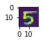
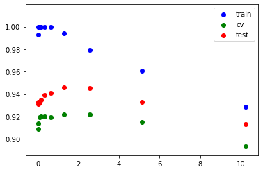

```python
import scipy.io as sio
import numpy as np
import pandas as pd
import matplotlib.pyplot as plt
%matplotlib inline
```


```python
#图像可视化
import time
data4 = sio.loadmat('ex4data1.mat')
for i in range(2980,2981):
    a = data4['X'][i,:].reshape(20,20)
    time.sleep(0.2)
    fig = plt.figure(figsize=(0.5,5))
    ax1 = fig.add_subplot(111)
    ax1.imshow(a.T)
```





```python
#读取theta值
Theta = sio.loadmat('ex4weights.mat')
theta1_file = Theta['Theta1']
theta2_file = Theta['Theta2']

# 数据查看与合并处理
x,y = data4['X'],data4['y']
new_data4 = np.hstack((x,y))
# y = y.reshape(5000)
new_data4.shape
```


    (5000, 401)


```python
def constants(ndim,axis=0):
    if axis == 0:
        return np.ones(ndim).reshape(-1,1)
    elif axis == 1:
        return np.ones(ndim).reshape(1,-1)

def sigmoid(x):
    return 1/(1+np.exp(-x))

#每一类的样本数
def number_of_class(array):
    all_number = []
    for i in range(1,11):
        single_number = array[array==i].shape[0]
        all_number.append(single_number)
    all_number.insert(0,all_number.pop())
    return all_number

all_number = number_of_class(y)

#分出训练集，验证集，测试集
key = 0
train_set = cv_set = test_set = np.array([])
for num in all_number:
    row_index = np.arange(num)
    np.random.shuffle(row_index)
    train_set = np.append(train_set,new_data4[key+row_index[0:int(num*0.6)]])
    cv_set = np.append(cv_set,new_data4[key+row_index[int(num*0.6):int(num*0.8)]])
    test_set = np.append(test_set,new_data4[key+row_index[int(num*0.8):num]])
    key += num
train_set = train_set.reshape(-1,new_data4.shape[1])
cv_set = cv_set.reshape(-1,new_data4.shape[1])
test_set = test_set.reshape(-1,new_data4.shape[1])

x_train = train_set[:,:-1]
y_train = train_set[:,-1].reshape(-1)
all_number_train = number_of_class(y_train)

x_cv = cv_set[:,:-1]
y_cv = cv_set[:,-1].reshape(-1)
all_number_cv = number_of_class(y_cv)

x_test = test_set[:,:-1]
y_test = test_set[:,-1].reshape(-1)
all_number_test = number_of_class(y_test)
```


```python

```


```python
m_train = len(x_train)   #样本数
m_cv,m_test = len(x_cv),len(x_test)
X_train = np.hstack((constants(m_train),x_train))   #加上常数项
X_cv = np.hstack((constants(m_cv),x_cv))
X_test = np.hstack((constants(m_test),x_test))
Y = np.array([[0,0,0,0,0,0,0,0,0,1],         #分类矩阵，类分别为10，1-9
                 [1,0,0,0,0,0,0,0,0,0],
                 [0,1,0,0,0,0,0,0,0,0],
                 [0,0,1,0,0,0,0,0,0,0],
                 [0,0,0,1,0,0,0,0,0,0],
                 [0,0,0,0,1,0,0,0,0,0],
                 [0,0,0,0,0,1,0,0,0,0],
                 [0,0,0,0,0,0,1,0,0,0],
                 [0,0,0,0,0,0,0,1,0,0],
                 [0,0,0,0,0,0,0,0,1,0]])

#forward propagation,25+1 hidden layer units, 400+1 input layer units, 10 output units
def loss_function(theta1,theta2,lamda=0,transverse=False):

    #前向传播
    if transverse:
        z1 = X_train.dot(theta1.T)
        a1 = np.hstack((constants(m_train),sigmoid(z1)))
        z2 = a1.dot(theta2.T)
        a2 = sigmoid(z2)   #练习题中准备
    else:
        z1 = X_train.dot(theta1)
        a1 = np.hstack((constants(m_train),sigmoid(z1)))
        z2 = a1.dot(theta2)
        a2 = sigmoid(z2)
    
    loss = 0
    index = 0
    
    #对应分类计算损失
    for j in range(len(all_number_train)):
        loss -= np.sum((np.log(a2[index:index+all_number_train[j]])).dot(Y[j]) + (np.log(1-a2[index:index+all_number_train[j]])).dot((1 - Y[j])))
        index += all_number_train[j]
    reg = lamda/(2*m)*(np.sum(np.power(theta1,2))+np.sum(np.power(theta2,2)))
    return loss / m + reg
```


```python
loss_function(theta1_file,theta2_file,lamda=0,transverse=True)
```


    0.28327579068461134


```python
#梯度下降检查
def gradient_check(theta1,theta2,lamda=0):
    ita = 0.0001
    dJ1 = dJ2 = []
#     for i in range(len(theta1)):
#         for j in range(len(theta1[i])):
#             theta1[i][j] = theta1[i][j] + ita
#             loss_plus = loss_function(theta1,theta2)
#             theta1[i][j] = theta1[i][j] - 2 * ita
#             loss_minus = loss_function(theta1,theta2)
#             theta1[i][j] = theta1[i][j] + ita
#             dj1 = (loss_plus - loss_minus) / (2 * ita)
#             dJ1.append(dj1)
    for i in range(len(theta2)):
        for j in range(len(theta2[i])):
            theta2[i][j] = theta2[i][j] + ita
            loss_plus = loss_function(theta1,theta2)
            theta2[i][j] = theta2[i][j] - 2 * ita
            loss_minus = loss_function(theta1,theta2)
            theta2[i][j] = theta2[i][j] + ita
            dj2 = (loss_plus - loss_minus) / (2 * ita)
            dJ2.append(dj2)
    return dJ2
```


```python
#训练神经网络，建立模型
def train_model(theta1,theta2,iter_number=1,alpha=0.01,lamda=0,print_loss=True):  #theta1  401*n,  theta2   n*10
   
    #迭代
    for i in range(iter_number):
        
    #forward propagation
        z1 = X_train.dot(theta1)
        a1 = np.hstack((constants(m_train),sigmoid(z1))) #3000*26
        z2 = a1.dot(theta2)
        a2 = sigmoid(z2)    #3000*10
    
    #计算error与loss
        index = 0
        loss = 0
        for j in range(len(all_number_train)):
            loss -= np.sum((np.log(a2[index:index+all_number_train[j]])).dot(Y[j]) + (np.log(1-a2[index:index+all_number_train[j]])).dot((1 - Y[j])))
            a2[index:index+all_number_train[j]] = a2[index:index+all_number_train[j]] - Y[j]
            index += all_number_train[j]
        loss = loss / m_train + lamda/(2*m_train)*(np.sum(np.power(theta1[:,1:],2))+np.sum(np.power(theta2[:,1:],2)))
    
    #backpropagation
        delta2 = (a1.T).dot(a2) / m_train
        reg2 = lamda / m_train * theta2
        delta1 = (X_train.T).dot(a2.dot(theta2.T) * (a1 * (1-a1))) / m_train   #矩阵求导仍需了解
        reg1 = lamda / m_train * theta1

        #计算损失梯度,与gradient_check比较
#         dJ2 = np.ravel(delta2 + reg2)
# #         dJ1 = np.ravel(delta1[:,1:] + reg1)
        
#         dj2 = gradient_check(theta1,theta2)
        
#         error2 = dJ2 - dj2
# #         error1 = dJ1 - dj1
#         print('error of theta2: ',error2)
        
    #更新theta参数   
        theta2 -= alpha * (delta2 + reg2)
        theta1 -= alpha * (delta1[:,1:] + reg1)
        
        model = {'theta1':theta1,'theta2':theta2}
        
        if i%200 == 0 and print_loss:
            print('iter times: %d; Loss is %f' %(i,loss))
        
    return model
        
```


```python
#数组中最大元素为1，其余元素为0
def max_to_1(arr):
    a = np.zeros_like(arr)
    a[range(len(arr)),arr.argmax(axis=1)] = 1
    return a
```


```python
#预测结果
def predict(X,all_class,model):
    theta1,theta2 = model['theta1'],model['theta2']
    z1 = X.dot(theta1)
    a1 = np.hstack((constants(len(X)),sigmoid(z1))) #3000*26
    z2 = a1.dot(theta2)
    a2 = sigmoid(z2)
    a2_predt = max_to_1(a2)
    index = counts = 0
    for j in range(len(all_class)):
        counts += np.sum(a2_predt[index:index+all_class[j]].dot(Y[j]))  
        index += all_class[j]
    print(counts)
    return counts / len(X)
```


```python
#输入维度,节点数（神经元个数），输出维度
n_input = X_train.shape[1]
n_output = len(all_number_train)
n_neural = 40
#初始化theta1和theta2
epsilon1 = np.sqrt(6) / np.sqrt(n_input + n_neural)
epsilon2 = np.sqrt(6) / np.sqrt(n_output + n_neural)
theta1 = np.random.rand(n_input,n_neural) * 2 * epsilon1 - epsilon1
theta2 = np.random.rand(n_neural+1,n_output) * 2 * epsilon2 - epsilon2
Lamda = [0.02*2**i for i in range(10)]
result_train = []
result_cv = []
result_test = []
for lamda in Lamda:
    t1,t2 = theta1,theta2
    r_model = train_model(t1,t2,iter_number=1200,alpha=2,lamda=lamda,print_loss=False)
    result_train.append(predict(X_train,all_number_train,r_model))
    result_cv.append(predict(X_cv,all_number_cv,r_model))
    result_test.append(predict(X_test,all_number_test,r_model))
plt.scatter(Lamda,result_train,c='b',label='train')
plt.scatter(Lamda,result_cv,c='g',label='cv')
plt.scatter(Lamda,result_test,c='r',label='test')
plt.legend(loc='best')
```

    2979.0
    909.0
    933.0
    3000.0
    914.0
    931.0
    3000.0
    919.0
    932.0
    3000.0
    920.0
    935.0
    3000.0
    920.0
    939.0
    3000.0
    919.0
    941.0
    2983.0
    922.0
    946.0
    2938.0
    922.0
    945.0
    2882.0
    915.0
    933.0
    2785.0
    893.0
    913.0
    


    <matplotlib.legend.Legend at 0xb901070>





```python

```


```python

```
