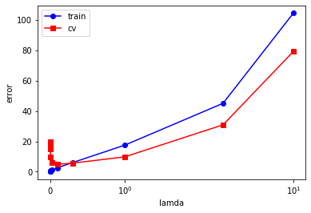

```python
import scipy.io as sio
import numpy as np
import matplotlib.pyplot as plt
```


```python
data5 = sio.loadmat('ex5data1.mat')
train_set = np.hstack((data5['X'],data5['y']))
cv_set = np.hstack((data5['Xval'],data5['yval']))
test_set = np.hstack((data5['Xtest'],data5['ytest']))
Label = ['train','cv','test']
color = ['b','g','r']
for i,data in enumerate([train_set,cv_set,test_set]):
    plt.scatter(data[:,0],data[:,1],c=color[i],label=Label[i],marker='x')
plt.legend(loc='best')
plt.show()
```


```python
#loss计算
def loss_function(x,y,theta,lamda=0):
    loss = np.sum(np.power(x.dot(theta) - y,2)) / (2*len(x)) + np.sum(np.power(theta,2)) * lamda / (2*len(x))
    return loss

#梯度下降
def gradient_descent(x,y,theta,lamda=0,alpha=0.01):
    d_theta = (x.T).dot(x.dot(theta) - y) / len(x)
    theta[0] -= alpha * d_theta[0]
    theta[1:] -= alpha * d_theta[1:] + theta[1:] * lamda / len(x)
    return theta

#特征维度增加
def feature_expansion(x,n_dim=2):
    X = []
    if n_dim < 2 or type(n_dim) != int:
        raise ValueError('n_dim is not legal!')
    else:
        for i in range(n_dim):
            X = np.append(X,np.power(x,i))
    return X.reshape(-1,len(x)).T

#模型训练
def train_model(X,y,theta,iter_n=1,lamda=0,alpha=0.1,print_loss=True):
    for i in range(iter_n):
        loss = loss_function(X,y,theta,lamda=lamda)
        theta = gradient_descent(X,y,theta,alpha=alpha,lamda=lamda)
        
        if (i+1) % 10000 == 0 and print_loss:
            print('loss of iter %d: %f' %(i+1,loss))
    
    return theta,loss

#特征向量归一化
def feature_normalized(x):
    u = np.mean(x,axis=0)
    sigma = np.std(x,axis=0)
    x_ = (x - u) / sigma
    return x_,u,sigma
```


```python
#线性特征
n_dim = 2
X_train = feature_expansion(train_set[:,0],n_dim=n_dim)
y_train = train_set[:,1]
X_cv = feature_expansion(cv_set[:,0],n_dim=n_dim)
y_cv = cv_set[:,1]
X_test = feature_expansion(test_set[:,0],n_dim=n_dim)
y_test = test_set[:,1]

theta_init = np.ones(n_dim)
model = train_model(X_train,y_train,theta_init,alpha=0.0015,iter_n=8000)
plt.scatter(X_train[:,-1],y_train,marker='x',c='b')
plt.plot(X_train[:,-1],X_train.dot(model[0]),c='r')
plt.show()
```


```python
#learning curve view in cross validation set
Model = []
error_train = []
error_cv = []
lamda = 0
for i in range(1,len(X_train)+1):
    x,y = X_train[0:i],y_train[0:i]
    theta_init = np.ones(n_dim)
    model,loss = train_model(x,y,theta_init,alpha=0.0015,iter_n=8000,print_loss=False,lamda=lamda)
    Model.append(model)
    error_train.append(loss)
error_cv= [loss_function(X_cv,y_cv,model,lamda=lamda) for model in Model]
plt.plot(range(len(X_train)),error_train,marker='o',c='b')
plt.plot(range(len(X_train)),error_cv,marker='s',c='r')
plt.title('High Bias')
plt.show()
```


```python
#多项式特征
n_dim = 9

X_train = feature_expansion(train_set[:,0],n_dim=n_dim)
y_train = train_set[:,1]
X_train_,u_train,sigma_train = feature_normalized(X_train[:,1:])
X_train_nor = np.hstack((X_train[:,0:1],X_train_))
# y_train_nor = feature_normalized(y_train)   #y不一定需要normalized

X_cv = feature_expansion(cv_set[:,0],n_dim=n_dim)
y_cv = cv_set[:,1]
X_cv_nor = np.hstack((X_cv[:,0:1],(X_cv[:,1:] - u_train) / sigma_train))
# y_cv_nor = feature_normalized(y_cv)

X_test = feature_expansion(test_set[:,0],n_dim=n_dim)
y_test = test_set[:,1]
X_test_,u_test,sigma_test = feature_normalized(X_test[:,1:])
X_test_nor = np.hstack((X_test[:,0:1],X_test_))
# y_test_nor = feature_normalized(y_test)

theta_init = np.ones(n_dim)
model = train_model(X_train_nor,y_train,theta_init,alpha=0.25,iter_n=20000,lamda=0.25)

plt.scatter(train_set[:,0],y_train,marker='x',c='b')

a = np.arange(-60,60,0.5)
a_ = feature_expansion(a,n_dim=n_dim)
a_nor = np.hstack((a_[:,0:1],(a_[:,1:] - u_train) / sigma_train))
plt.plot(a,a_nor.dot(model[0]),c='r')
plt.show()
```

    loss of iter 10000: 4.487408
    loss of iter 20000: 4.487408
    


```python
#learning curve view in cross validation set of polynomial features
Model = []
error_train = []
error_cv = []
lamda = 0.2
for i in range(1,len(X_train_nor)+1):
    x,y = X_train_nor[0:i],y_train[0:i]
    theta_init = np.ones(n_dim)
    model,loss = train_model(x,y,theta_init,alpha=0.15,iter_n=20000,print_loss=False,lamda=lamda)
    Model.append(model)
    error_train.append(loss)
error_cv= [loss_function(X_cv_nor,y_cv,model,lamda=lamda) for model in Model]
plt.plot(range(len(X_train_nor)),error_train,marker='o',c='b')
plt.plot(range(len(X_train_nor)),error_cv,marker='s',c='r')
plt.title('High variance')
plt.show()
```


```python
#不同的lamda对训练集与验证集的影响
n_dim = 9
Lamda = [0,0.001,0.003,0.01,0.03,0.1,0.3,1,3,10]
error_train_ = []
error_cv_ = []
for lamda in Lamda:
    theta_init = np.ones(n_dim)
    model,loss_train = train_model(X_train_nor,y_train,theta_init,alpha=0.15,iter_n=20000,lamda=lamda,print_loss=False)
    loss_cv = loss_function(X_cv_nor,y_cv,model,lamda=lamda)
    error_train_.append(loss_train)
    error_cv_.append(loss_cv)
plt.plot(Lamda,error_train_,marker='o',c='b',label='train')
plt.plot(Lamda,error_cv_,marker='s',c='r',label='cv')
plt.legend(loc='best')
plt.xlabel('lamda')
plt.ylabel('error')
plt.xscale('symlog')
plt.show()
```





```python

```


```python

```
