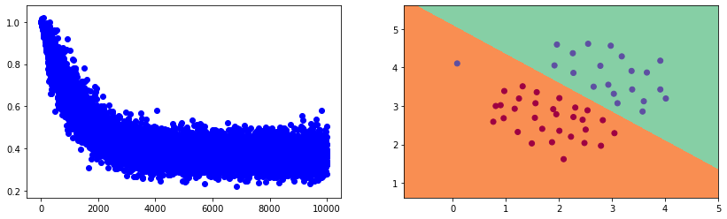
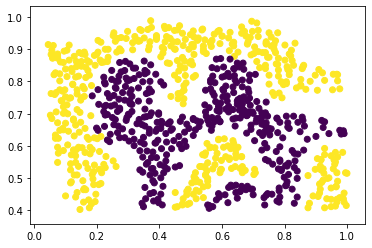
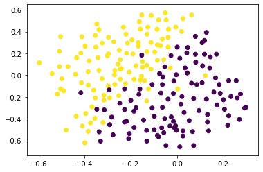
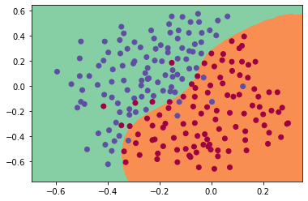
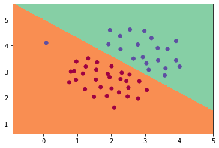
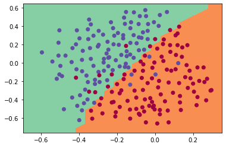

```python
import scipy.io as sio
import numpy as np
import pandas as pd
import matplotlib.pyplot as plt
```


```python
#数据处理，加常数项，区分正负样本，可视化
raw_data6 = sio.loadmat('./ex6data1.mat')
data6 = np.hstack((np.ones(len(raw_data6['X'])).reshape(len(raw_data6['X']),-1),raw_data6['X'],raw_data6['y']))
y = data6[:,-1]
y[y==0] = -1
X = data6[:,:-1]
pos_X = data6[data6[:,-1]==1][:,:-1]
neg_X = data6[data6[:,-1]==-1][:,:-1]
# plt.scatter(pos_X[:,1],pos_X[:,2],marker='+',c='r')
# plt.scatter(neg_X[:,1],neg_X[:,2],marker='.',c='b')
# plt.xlabel('x1')
# plt.ylabel('x2')
# plt.show()
```


```python
#定义损失函数hinge loss及梯度
def HingeLoss(x,y,theta):
    temp = np.copy(x)
    margins = 1 - x.dot(theta) * y
    temp[margins < 0] = 0
    margins[margins < 0] = 0
#     print(margins)
#     print(temp)
    grad = np.sum(-temp.T * y,axis=1) / len(x)
    loss = np.sum(margins) / len(x)
    return loss,grad
```


```python
#决策边界可视化
def plot_decision_boundary(predict_func,X,y):
    x_min,x_max = X[:,0].min() - 0.1, X[:,0].max() + 0.1   #线性核与高斯核需要统一，输入X需要统一
    y_min,y_max = X[:,1].min() - 0.1, X[:,1].max() + 0.1
    step = 0.05
    xx,yy = np.meshgrid(np.arange(x_min,x_max,step),np.arange(y_min,y_max,step))
    constants = np.ones(xx.shape[0]*xx.shape[1])
    Z = predict_func(np.vstack((xx.ravel(),yy.ravel())).T)   #线性核与高斯核需要统一，输入X需要统一
    Z = Z.reshape(xx.shape)
    plt.contourf(xx,yy,Z,0,cmap=plt.cm.Spectral)
    plt.scatter(X[:,0],X[:,1],c=y,cmap=plt.cm.Spectral)    #线性核与高斯核需要统一，输入X需要统一

# #预测函数
# def Predict(x,theta):
#     return x.dot(theta)
```


```python
#目标函数与梯度下降（正则化项）
def Optimize(x,y,theta):
    x_,y_,theta_ = x,y,theta
    loss,grad = HingeLoss(x_,y_,theta_) 
    t_loss = loss + 1/2 * lamda * np.sum(theta_ * theta_)
    theta_ -= alpha * (grad + lamda * theta_)
    return t_loss,theta_
```


```python
#训练  学习率选取较大时，出现正则化项，用梯度下降优化目标函数时容易发散，结果不收敛，需要降低学习率，同时设置较小的正则化参数
n_feature = 3
alpha = 0.01
lamda = 0.01
batch_size = 50
theta1 = np.zeros(n_feature)
# theta1 = np.array([-7.3,1.0,1.5])
Loss = []
n = 10000
for i in range(n):
    batch_index = np.random.choice(len(X),batch_size)
    x_batch = X[batch_index,:]
    y_batch = y[batch_index]
    loss,theta1 = Optimize(x_batch,y_batch,theta1)
    Loss.append(loss)
fig = plt.figure(figsize=(14,4))
ax1 = plt.subplot(121)
ax2 = plt.subplot(122)
ax1.scatter(range(n),Loss,c='b')
ax2 = plot_decision_boundary(lambda x: x.dot(theta1),X,y)
plt.show()
theta1
```





    array([-5.04810494,  0.73866803,  0.9857467 ])


```python

```


```python

```


```python
#非线性支持向量机，对非线性样本进行分类
nl_data6 = sio.loadmat('./ex6data2.mat')
X,y = nl_data6['X'],nl_data6['y']
y = y.astype('int8').reshape(len(y))
y[y==0] = -1
plt.scatter(X[:,0],X[:,1],c=y)
plt.show()
```





```python
#kernel核函数
def GaussianKernel(x,z):
    return np.exp( - 0.5 * np.sum((x - z)**2,axis=1) / (sigma ** 2))
```


```python
#通过核函数将样本特征映射到高维空间，进行线性分类
def feature_map(x,lm):
    f_matrixs = np.array([])
    for i in range(len(x)):
        f_matrixs = np.append(f_matrixs, GaussianKernel(x[i],lm))
    f_matrixs = f_matrixs.reshape(len(x),-1)
    return f_matrixs
```


```python
#gaussianKernel的训练函数
def svm_train_kernel(X,y,iteration=100,batch_size = 200):
    n_samples,n_features = X.shape
    theta1 = np.random.randn(n_features)
    Loss = []
    for i in range(iteration):
        batch_index = np.random.choice(n_samples,batch_size)
        x_batch = X[batch_index,:]
        y_batch = y[batch_index]
        loss,theta1 = Optimize(x_batch,y_batch,theta1)
        Loss.append(loss)
    return Loss,theta1

# Loss,weights = svm_train_kernel(features,y,iteration=2000,batch_size = 200)

# fig = plt.figure(figsize=(14,4))
# ax1 = plt.subplot(121)
# # ax2 = plt.subplot(122)
# ax1.scatter(range(n),Loss,c='b')
# # ax2 = plot_decision_boundary(lambda x: x.dot(theta1),X,y)
# plt.show()
# # theta1
```


```python
def predict_score(x,y):
    res = x.dot(weights)
    res[res>0] = 1
    res[res<0] = -1
    score = res[res==y].shape[0] / len(y)
    return res,score
```


```python
sigma = 0.05
features = np.hstack((np.ones_like(y).reshape(len(y),-1),feature_map(X,X)))
alpha = 0.1
lamda = 0.1

Loss,weights = svm_train_kernel(features,y,iteration=2000,batch_size=20)
predict_score(features,y)[1]
```


    0.9826187717265353


```python
#非线性分类，训练集与验证集
nl2_data6 = sio.loadmat('./ex6data3.mat')
X,y = nl2_data6['X'],nl2_data6['y']
Xval,yval = nl2_data6['Xval'],nl2_data6['yval']
y = y.astype('int8').reshape(-1)
y[y==0] = -1
yval = yval.astype('int8').reshape(-1)
yval[yval==0] = -1
plt.scatter(X[:,0],X[:,1],c=y)
plt.show()
```





```python
#用测试集优化超参数
Sigma = [0.01,0.03,0.1,0.3,1]  
train_features = np.hstack((np.ones_like(y).reshape(len(y),-1),feature_map(X,X)))
cv_features = np.hstack((np.ones_like(yval).reshape(len(yval),-1),feature_map(Xval,X)))
Alpha = [0.003,0.01,0.03,0.1,0.3]  
Lamda = [0.01,0.03,0.1,0.3,1]  

# best_score = 0
# best_sigma = 0
# best_lamda = 0
# best_alpha = 0
# Score = []
# for alpha in Alpha:
#     for sigma in Sigma:
#         for lamda in Lamda:
#             Loss,weights = svm_train_kernel(train_features,y,iteration=2000,batch_size=10)
#             score = predict_score(cv_features,yval)[1]
#             Score.append(score)
#             if score > best_score:
#                 best_score = score
#                 best_sigma = sigma
#                 best_lamda = lamda
#                 best_alpha = alpha
# print('best score is %f\nbest sigma is %f\nbest lamda is %f\nbest alpha is %f' %(best_score,best_sigma,best_lamda,best_alpha))
# print(Score)
# best score is 0.925000
# best sigma is 0.100000
# best lamda is 0.010000
# best alpha is 0.030000
```


```python
#决策边界可视化
sigma = 0.14
lamda = 0.01
alpha = 0.03
Loss,weights = svm_train_kernel(train_features,y,iteration=4000,batch_size=10)
score = predict_score(cv_features,yval)[1]
plot_decision_boundary(lambda x: np.hstack((np.ones(len(x)).reshape(len(x),-1),feature_map(x,X))).dot(weights),X,y)
plt.show()
score
```





    0.945


```python

```


```python

```


```python
from sklearn.svm import LinearSVC
clf = LinearSVC(C=1,loss='hinge',max_iter=50000)
clf.fit(X,y)
plot_decision_boundary(lambda x: clf.predict(x),X,y)
```





```python
from sklearn.svm import SVC
clf = SVC(C=1,kernel='rbf',gamma=2)
clf.fit(X,y)
plot_decision_boundary(lambda x: clf.predict(x),X,y)
clf.score(Xval,yval)
```


    0.94





```python

```


```python

```
