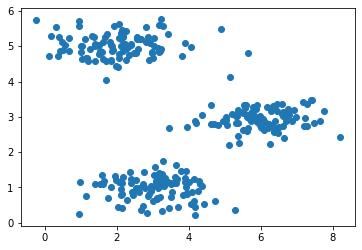
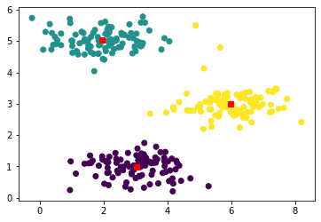
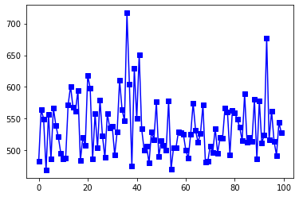
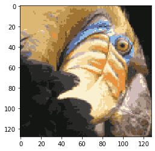

```python
import scipy.io as sio
import numpy as np
import matplotlib.pyplot as plt
import matplotlib.image as im
```


```python
data7_1 = sio.loadmat('./ex7data2.mat')
x = data7_1['X']
plt.scatter(x[:,0],x[:,1])
plt.show()
```





```python
class kmeans():
#静态变量
    total_loss = 0
#     n_samples = x.shape[0]
#初始化变量设置，聚类中心3个，设定初始值，输入为x
    def __init__(self,x,k,tolerance=0.5):
        self.k = k
        self.x = x
        self.tolerance = tolerance
        self.n_samples = x.shape[0]
        self.k_pos = x[np.random.choice(self.n_samples,k)]
        self.cluster = np.zeros(self.n_samples)
#归类
    def find_cluster(self,):
        loss = np.sum((self.x - self.k_pos[0]) ** 2,axis=1)
        for i in range(1,self.k):
            distance = np.sum((self.x - self.k_pos[i]) ** 2,axis=1)
            self.cluster[distance<loss] = i
            loss[distance<loss] = distance[distance<loss]
        kmeans.total_loss = np.sum(loss) / self.n_samples
        return self.cluster
#计算新的聚类中心
    def compute_center(self,):
        for i in range(self.k):
            self.k_pos[i] = np.sum(self.x[self.cluster==i],axis=0) / self.x[self.cluster==i].shape[0]
        return self.k_pos
#重复上述两步直至收敛
    def train(self,):
        counts = 0
        self.cluster = self.find_cluster()
        current_loss = kmeans.total_loss
        last_loss = kmeans.total_loss
        diff = kmeans.total_loss
        while diff > self.tolerance:
            self.k_pos = self.compute_center()
            self.cluster = self.find_cluster()
            current_loss = kmeans.total_loss
            diff = last_loss -current_loss
            last_loss = kmeans.total_loss
            counts += 1
#         print(counts)
        return self.cluster
#获取聚类中心
    def get_centerPos(self,):
        return self.k_pos
```


```python
# 样本点聚类
a=kmeans(x,3)
cl=a.train()
kc=a.get_centerPos()
plt.scatter(x[:,0],x[:,1],c=cl)
plt.scatter(kc[:,0],kc[:,1],c='r',marker='s')
plt.show()
```





```python
#图像颜色聚类
data7_2 = sio.loadmat('./bird_small.mat')
# plt.imshow(data7_2['A'])
x_photo = np.reshape(data7_2['A'],(-1,3)).astype('int32')

Cl = []
Kc = []
Loss = []
for i in range(100):
    im_cmp = kmeans(x_photo,16,tolerance=0.0001)
    cl = im_cmp.train()
    kc = im_cmp.get_centerPos()
    loss = im_cmp.total_loss
    Cl.append(cl)
    Kc.append(kc)
    Loss.append(loss)
plt.plot(range(100),Loss,c='b',marker='s')
```

    c:\users\小昔米\appdata\local\programs\python\python37-32\lib\site-packages\ipykernel_launcher.py:25: RuntimeWarning: invalid value encountered in true_divide
    


    [<matplotlib.lines.Line2D at 0x7d2710>]





```python
best_index = Loss.index(min(Loss))
best_cluster = Cl[best_index]
best_k_center = Kc[best_index]
r_photo = np.zeros_like(x_photo)
for i in range(16):
    r_photo[best_cluster==i] = best_k_center[i]
r_photo = r_photo.reshape(128,128,3)
plt.imshow(r_photo)
plt.show()
```





```python
plt.imshow(x_photo.reshape(128,128,3))
```


    <matplotlib.image.AxesImage at 0x7c9ed0>


