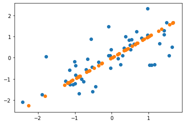
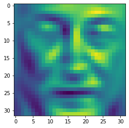
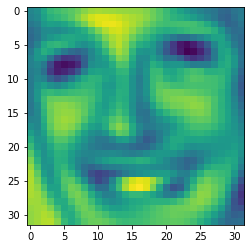

```python
import scipy.io as sio
import numpy as np
import matplotlib.pyplot as plt
import matplotlib.image as im
```


```python
#特征归一化
def feature_normalized(x):
    f_mean = np.mean(x,axis=0,keepdims=True)
    f_std = np.std(x,axis=0,keepdims=True)
    x_nor = (x - f_mean) / f_std
    return x_nor,f_std,f_mean
#PCA降维(方法一：基于特征协方差的特征值分解)
def pca(x):
    co_matrix = x.T.dot(x) / len(x)
    u,s,v = np.linalg.svd(co_matrix)
    return u,s,v
#重构特征
def feature_reconstructed(x,k,u):
    z = x.dot(u[:,:k])
    x_appr = z.dot(u[:,:k].T)
    return z,x_appr
```


```python
# a = np.array([[1,4.5,3],[3,8.1,6]])
# a,std,mean = feature_normalized(a)
# u,s,v = pca(a)
# z = feature_reconstructed(a,3,u)
```


```python
data8_1 = sio.loadmat('./ex7data1.mat')
x = data8_1['X']
```


```python
k = 1
x_nor,std,mean = feature_normalized(x)
u,s,v = pca(x_nor)
#如需进行数据对比需要将u列向量normalize，此处未作
z,x_appr = feature_reconstructed(x_nor,k,u)
plt.scatter(x_nor[:,0],x_nor[:,1])
plt.scatter(x_appr[:,0],x_appr[:,1])
plt.show()
```





```python
#人脸数据降维
data8_2 = sio.loadmat('./ex7faces.mat')['X']
#随机10张图片显示
def im_show(data):
    im = data[np.random.choice(len(data),1)].reshape(32,32)
    plt.imshow(im.T)
# im_show(data8_2)
```


```python
k = 100
X_nor,std1,mean1 = feature_normalized(data8_2)
u1,s1,v1 = pca(X_nor)

#主成分绘制图像
# u_r = u1[:,0].reshape(32,32)
# plt.imshow(u_r.T)

#前k个特征向量重构图像
z,x_appr1 = feature_reconstructed(X_nor,100,u1)
im_show(x_appr1)
```





```python

```


```python
#方法二：基于数据矩阵的奇异值分解
u2,s2,v2 = np.linalg.svd(data8_2)
z2 = data8_2.dot(v2[:100,:].T)
x_appr2 = z2.dot(v2[:100,:])
im_show(x_appr2)
```





```python
delta1 = np.sum(s1[:100])/np.sum(s1)
delta2 = np.sum(s2[:100])/np.sum(s2)
print(delta1,delta2)
```

    0.9319320428645927 0.5535489586835647
    


```python

```


```python

```
