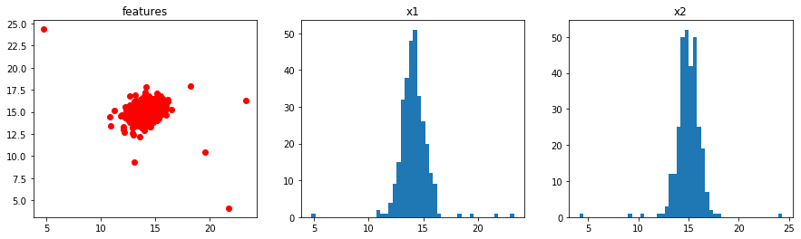
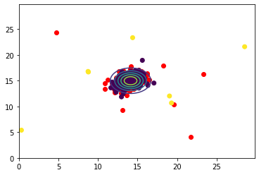
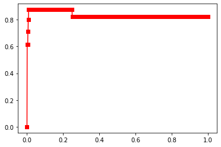
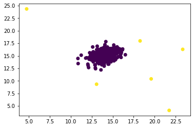
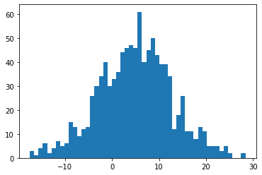
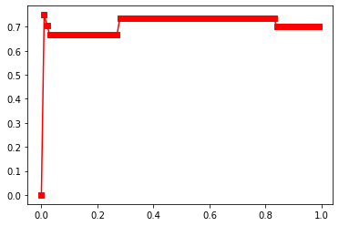

```python
import scipy.io as sio
import numpy as np
import matplotlib.pyplot as plt
%matplotlib inline
```


```python
data9_1 = sio.loadmat('./ex8data1.mat')
X_train1 = data9_1['X']
X_val1 = data9_1['Xval']
y_val1 = data9_1['yval'].reshape(-1)
plt.figure(figsize=(15,4))
ax1 = plt.subplot(131)
ax2 = plt.subplot(132)
ax3 = plt.subplot(133)
ax2.hist(X_train1[:,0],50)
ax1.scatter(X_train1[:,0],X_train1[:,1],c='r')
ax3.hist(X_train1[:,1],50)
ax1.set_title('features')
ax2.set_title('x1')
ax3.set_title('x2')
plt.show()
```





```python
#样本的均值与方差
def f_mean(X_train):
    return np.mean(X_train,axis=0)
def f_variance(X_train):
    return np.std(X_train,axis=0) ** 2
#gaussian distribution
def gauss_dt(x,f_mean,f_variance,n):
    pro = 1/((2*np.pi*f_variance)**0.5)*np.exp(-0.5*(x-f_mean)**2/f_variance)
    pros = 1
    for i in range(pro.shape[1]):   
        pros *= pro[:,i]
    return pros*n
#精确度与召回率，F_score
def F_score(y_predict,y):
    tp = np.sum(y_predict[y==1])
    precision = tp / y_predict[y_predict==1].shape[0] if np.sum(y_predict) != 0 else 0
    recall = tp / y[y==1].shape[0]
    if precision or recall:
        f_score = 2 * precision * recall / (precision + recall)
    else:
        f_score = 0
    return f_score
```


```python
mean1 = f_mean(X_train1)
variance1 = f_variance(X_train1)
```


```python
x = y = np.arange(0,30,0.2)
xx,yy = np.meshgrid(x,y)
x_plot = np.vstack((np.ravel(xx),np.ravel(yy))).T
plt.contour(xx,yy,gauss_dt(x_plot,mean1,variance1,10).reshape(xx.shape),5)
plt.scatter(X_train1[:,0],X_train1[:,1],c='r')
plt.scatter(X_val1[:,0],X_val1[:,1],c=y_val1)
plt.show()
```





```python
#验证集确定阈值
score =[]
Epsilon = np.arange(0.0,1,0.001)
for epsilon in Epsilon:
    pros = gauss_dt(X_val1,mean1,variance1,500)
    pros[pros>epsilon] = 0
    pros[pros!=0] = 1
    score.append(F_score(pros,y_val1))
plt.plot(Epsilon,score,marker='s',c='r')
plt.show()
```





```python
best_epsilon = 0.2
pros = gauss_dt(X_train1,mean1,variance1,500)
pros[pros>best_epsilon] = 0
pros[pros!=0] = 1
plt.scatter(X_train1[:,0],X_train1[:,1],c=pros)
plt.show()
# pros
```





```python
#高维数据
data9_2 = sio.loadmat('./ex8data2.mat')
X_train2 = data9_2['X']
X_val2 = data9_2['Xval']
y_val2 = data9_2['yval'].reshape(-1)
plt.hist(X_train2[:,0],50)
plt.show()
```





```python
mean2 = f_mean(X_train2)
variance2 = f_variance(X_train2)
score =[]
Epsilon = np.arange(0.0,1,0.01)
for epsilon in Epsilon:
    pros = gauss_dt(X_val2,mean2,variance2,3e18)
    pros[pros>epsilon] = 0
    pros[pros!=0] = 1
    score.append(F_score(pros,y_val2))
plt.plot(Epsilon,score,marker='s',c='r')
plt.show()
```





```python
best_epsilon = [0.01,0.5] #0.01为F_sore最大得分，实际效果并不好，0.5效果更好
pros = gauss_dt(X_train2,mean2,variance2,3e18)
pros[pros>best_epsilon[1]] = 0
pros[pros!=0] = 1
print('anomaly_numbers:',pros[pros==1].shape[0])
# print('F_score:',F_score(pros,y_val2))
# print('yval:',y_val2)
# print('pros:',pros.astype(int))
```

    anomaly_numbers: 40
    


```python

```


```python

```
